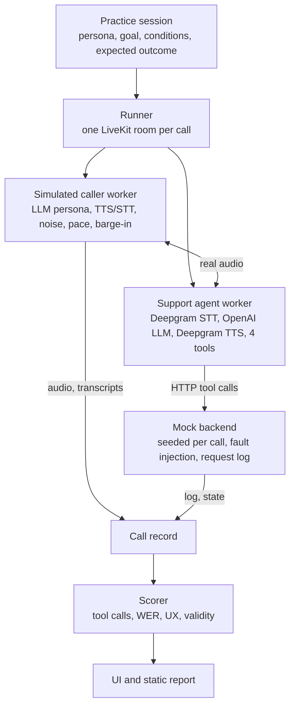

<!-- Exported from the Claude Doc PRD on 2026-10-08. The doc remains the editing surface; this copy is for the repository. -->

# Voice Agent Call Simulator — PRD

2026-10-08 · Artem Ustimenko

We will build a small platform that runs simulated phone calls against a LiveKit support agent, then scores every call on what actually happened in the backend and on the audio, and shows it in a simple web UI.

Implementation spec: `docs/spec.md` in the repository (parts, tasks, verification steps and gates). Status: decisions finalised 2026-10-08; build starts with the mock backend and the LiveKit support agent.

## Goals and scope

The primary success criterion for v1 is that every score reflects what actually happened on the call. All other functionality is kept minimal.

**In scope**

1. A sample support agent on LiveKit Agents with 4 tools, backed by a mock order backend.
2. An LLM-driven simulated caller that joins the same LiveKit room and speaks over real audio.
3. Practice sessions (persona + goal + caller conditions + expected outcome), generated from a short agent description or written by hand, each run N times.
4. A call record per call: stereo recording, both transcripts, every tool call with arguments, result and timing, and turn timings.
5. Scores for tool calls, speech accuracy (WER), user experience and validity, with pass rates over repeated runs and a timestamp behind every score.
6. A web UI showing the agent config, sessions, runs, a one-minute report and a per-call timeline.
7. One command to run it all, a README, a sample report with at least one real caught failure, and a short design note.

**Out of scope for v1**

- Real PSTN/SIP calls. Calls run as WebRTC in a LiveKit room, with telephony conditions simulated (8 kHz resample, codec loss, noise).
- A second provider. We design the seam for it but do not build it.
- Auth, multi-user, a database server, cloud deploy, CI gating, prompt optimisation.
- Editing the agent from the UI. The agent is configured in a file and shown read-only.

## Key decisions

| Decision | Choice | Rationale |
| --- | --- | --- |
| Provider | LiveKit Agents (Python, 1.x) on LiveKit Cloud | Open-source agent framework with direct access to audio tracks and pipeline events. Hosted rooms remove the need to operate a media server; a local `livekit-server --dev` supports offline development. |
| Isolation | A dedicated LiveKit Cloud project with its own API credentials | The platform shares no project, credentials, rooms or agent dispatch with any other LiveKit workload. See isolation requirements below. |
| Speech | Deepgram for both STT (Nova-3) and TTS (Aura-2), for the agent and the simulated caller | One vendor and one key for all speech; Nova-3 supports keyterm boosting for order ids. |
| LLM | OpenAI only. Agent and caller share one model; the judge runs a different model at temperature 0 with a versioned prompt | One key; judge independence comes from model choice and prompt versioning. |
| Caller transport | The simulated caller is a second LiveKit participant (its own agent worker) in the same room | Real audio in both directions through the provider, with no SIP dependency. The caller's own utterance text provides the WER reference. |
| Tools | Agent tools are thin HTTP calls to a separate mock backend | Grading reads the backend request log and final state, not the agent's statements. The same backend serves any future provider via webhooks. |
| Timing source of truth | Measured from the stereo recording (VAD per channel), not from agent self-reported metrics | Latency, dead air and overlap must reflect what the caller heard. Agent pipeline metrics are retained as a breakdown (STT / LLM / TTS). |
| Repeats | 3 attempts per session by default, configurable per run | Enough to expose flakiness at acceptable cost. |
| Sessions | Immutable: a session's id is the hash of its content; the UI creates new sessions and never edits existing ones | Results stay attributable to exactly one definition. |
| LLM judge usage | Deterministic checks first; an LLM judge only for what code cannot check (claims vs. actions, character consistency, repeats) | Uncalibrated judges are noisy, so a judge never decides pass/fail alone and always cites a timestamp. |
| Storage | Plain files per call (JSON + WAV) plus a SQLite index | Inspectable, diffable and portable; no database server. |
| UI | Python only: FastAPI, Jinja2 templates and htmx; the same templates render the live UI and the static report | One rendering path to test; no JavaScript build toolchain. |
| Invalid calls | Calls where the simulation failed are marked invalid and excluded | Simulator faults must not count against the agent. |

**Isolation requirements**

- A dedicated LiveKit Cloud project. Credentials are stored only in this repository's `.env` and are not shared with other projects.
- Workers register with explicit agent names (`gf-support-agent`, `gf-sim-caller`) and use explicit dispatch, so they accept no other jobs and no other agents join platform rooms.
- Rooms are named `gf-sim-<run_id>-<call_id>` and deleted when the call ends.
- Dedicated LLM, STT and TTS API keys, so usage and cost are attributed to this platform alone.
- The codebase is self-contained, with no runtime dependency on other internal services.

## Architecture



The runner creates one LiveKit room per call and dispatches two workers into it: the simulated caller and the support agent, which exchange real audio. The agent's tools hit the mock backend over HTTP. The caller's audio and transcripts, the agent's events and the backend's log are merged into one call record, which is the only input to the scorer and the UI.

## Sample support agent and mock backend

The reference agent is a representative e-commerce support line ("Gateway Goods"). It is defined in one file, `agent/config.yaml` (prompt, voice, STT/LLM/TTS models, tools), which the UI shows read-only.

**Pipeline:** Deepgram STT → OpenAI LLM → Deepgram TTS (Aura-2), Silero VAD and LiveKit turn detection. Exact models are listed in config and in each call record.

**Tools** (each one is an HTTP call to the mock backend):

| Tool | Arguments | Backend effect | Rules the agent must follow |
| --- | --- | --- | --- |
| `lookup_order` | `order_id` | Read only | Verify the caller (name + zip) before sharing details |
| `issue_refund` | `order_id`, `amount`, `reason` | Writes a refund | Only for delivered orders, amount ≤ order total, once per order |
| `escalate_to_human` | `reason`, `summary` | Creates a ticket and ends the call | Use when policy blocks the request or the caller asks for a person |
| `update_shipping_address` | `order_id`, `address` | Writes the address | Only for orders not yet shipped |

**Mock backend** (FastAPI, in its own container):

- Seeded per call from the session's `fixtures` (customers, orders), so every call starts from a known state and calls never share data.
- Logs every request with timestamp, arguments, response, status and latency. This log, plus the final state, is what grading reads.
- Fault injection per session: added latency, a 500 error, a timeout, or a business-rule rejection (for example "refund already issued"). This tests how the agent handles failures and whether it lies about them.
- Exposes `GET /calls/{call_id}/log` and `GET /calls/{call_id}/state` for the scorer and UI.

## Practice sessions

A practice session is one YAML file in `sessions/`: who calls, what they want, how the call sounds, and what must be true in the backend afterwards. Each session runs N times (default 3).

```yaml
id: refund-damaged-item-noisy
title: Refund for a damaged blender, caller in a busy cafe
persona:
  name: Maria Lopez
  style: polite but impatient, speaks fast
  accent: es-MX English          # picks the TTS voice
  facts: {order_id: "GW-48213", zip: "94110", amount: 89.99}
goal: Get a full refund for order GW-48213, which arrived broken.
conditions:
  noise: cafe@15dB                # mixed into the caller's audio
  pace: 1.2                       # TTS speed
  interruptions: sometimes        # barge-in while the agent speaks
  patience_s: 20                  # hangs up after this much dead air in total
  max_duration_s: 180
fixtures: fixtures/orders_basic.yaml
faults: []                        # e.g. [{tool: issue_refund, type: error_500}]
expected:
  outcome: refunded
  tool_calls:
    required:
      - {tool: lookup_order, args: {order_id: "GW-48213"}}
      - {tool: issue_refund, args: {order_id: "GW-48213", amount: 89.99}}
    order: [lookup_order, issue_refund]
    forbidden: [escalate_to_human, update_shipping_address]
  final_state:
    - refunds[GW-48213].amount == 89.99
```

**Generating sessions.** `gf sessions generate --from agent/description.md --count 12` asks an LLM for a spread across the agent's tools: happy paths, policy edge cases (refund on an undelivered order), injected backend faults, and hard callers (noise, accents, interruptions). Generated files land in `sessions/generated/` for a person to review. A schema check rejects any session whose `expected` block names a tool or argument the agent does not have, or a fixture that does not exist.

**Writing sessions by hand.** Copy a YAML file and edit it, or use the "New session" form in the UI, which writes the same YAML. The README walks through adding one.

**Sessions are immutable.** A session's `id` is the hash of its content, and the loader refuses a file whose id does not match. To change a session, create a new one; results always refer to exactly one definition.

**Expected outcome is code, not prose.** Pass/fail comes from `required`, `order`, `forbidden` and `final_state`. A free-text `notes` field may add guidance for the judge, but it never decides pass/fail.

## Simulated caller

The caller is a second LiveKit agent worker (`gf-sim-caller`) that joins the call room as a normal participant. It hears the agent through its own STT and speaks through TTS, so every word crosses real audio.

**Brain.** An LLM plays the persona from the session's `persona` and `goal`, and knows only the facts given to it (it cannot invent a different order number). Each turn it returns structured output: what to say, plus private flags (`goal_met`, `giving_up`, `repeating_myself`, `broke_character`). The flags feed scoring and validity.

**Audio conditions**, applied to the caller's outgoing track before it is published:

- Accent: a Deepgram Aura voice chosen per session. Coverage is limited to that catalogue, so noise, pace and interruptions carry most of the variation; a per-session TTS override hook allows another vendor later.
- Pace: TTS speed.
- Noise: a background clip (cafe, street, car) mixed at a set SNR.
- Phone line: resample to 8 kHz and back, plus light packet loss, so the agent hears a phone-quality signal.
- Interruptions: with set probability, the caller starts its next line while the agent is still talking.
- Impatience: a dead-air budget; when it runs out the caller says it is giving up and hangs up.

**Ending the call.** The caller hangs up when its goal is met, when it gives up (patience spent, or it judges no progress after K turns), or at `max_duration_s`. The agent's `escalate_to_human` also ends the call. The end reason is stored.

**Validity.** A call is marked `invalid` (and excluded from the agent's scores) when the simulation itself broke: the caller LLM errors or times out, it breaks character or states facts that contradict its persona, its audio never reached the room, or it hung up before trying its goal. A cheap judge pass checks character consistency after the call. The reason is shown in the UI so it can be fixed, and invalid rates are reported per session.

## Call record

Every call writes one folder, `runs/<run_id>/<session_id>/<attempt>/`, and every timestamp in it is in milliseconds from call start on a single clock.

| File | Contents | Source |
| --- | --- | --- |
| `audio.wav` | Stereo: left = caller as sent (after noise and phone line), right = agent as heard by the caller | Recorded by the caller worker from both tracks; no Egress service needed |
| `transcript.json` | Turns with speaker, start/end and words with timings, in two versions: what the caller said (its own text, the reference) and what the agent heard (the agent's STT finals) | Caller LLM output + TTS word alignment; agent session events |
| `tools.json` | Each tool call: name, arguments, response, status, start/end, and the agent turn that made it | Backend request log, joined by an `X-GF-Call-Id` header |
| `timeline.json` | Speech segments per channel, agent pipeline metrics per turn (end-of-turn delay, LLM time to first token, TTS time to first byte), interruptions | VAD over `audio.wav` + agent metrics events |
| `backend_state.json` | Backend state before and after the call | Mock backend |
| `meta.json` | Session, attempt, agent config hash, models, voices, end reason, validity, cost | Runner |
| `scores.json` | Every score with its evidence (timestamps and ids) | Scorer |

**Clock alignment.** Both workers run on the same host and log monotonic time. At join, the caller sends a sync message over the room data channel, and both sides record the offset. Audio-derived timings are the source of truth; event timings are corrected to them.

**Re-scoring.** The scorer only reads these files, so we can change a scoring rule and re-score old calls without re-running them (`gf score runs/<run_id>`).

## Scoring

A call passes when its outcome checks pass and no hard failure fires; everything else is a graded signal shown beside it. Every score links to the moment in the call that caused it.

**1. Tool calls and outcome** (deterministic, from the backend log and state, never from what the agent said)

| Check | Rule | Hard fail? |
| --- | --- | --- |
| Required calls | Each `required` call happened with matching arguments (exact, or numeric within 1 cent) | Yes |
| Order | Calls happened in `order` | Yes |
| Forbidden calls | No `forbidden` tool was called | Yes |
| Final state | Every `final_state` assertion holds | Yes |
| Extra calls | Unexpected but harmless calls (a second lookup) | No, counted |
| Claimed without acting | The agent said an action was done ("your refund is processed") but the backend has no matching successful write. An LLM pulls claims from the agent transcript with timestamps; code checks each against the log | Yes |
| Error handling | After an injected fault, the agent told the caller truthfully and retried or escalated | Yes when it lied |

**2. Speech accuracy (WER)**

- WER per call and per turn between what the caller said and what the agent heard, after normalisation (case, punctuation, numbers to words).
- Entity accuracy: the caller's `facts` (order ids, names, zip codes, amounts) are tagged in its own text, and we check whether each reached the agent's transcript intact.
- Causal link: when a misheard entity then appears in a tool argument, the call shows "misheard GW-48213 as GW-48203 → lookup\_order called with GW-48203". This is the primary speech-accuracy signal.

**3. User experience** (measured on the stereo audio)

| Metric | How | Default flag |
| --- | --- | --- |
| Response latency | Caller stops speaking → agent's first audio, p50 and p95 per call | p95 > 2.0 s |
| Dead air | Silence on both channels mid-call | Any gap > 3 s |
| Talk-over | Agent starts speaking while the caller is talking | > 2 per call |
| Barge-in handling | When the caller interrupts, time until the agent goes quiet | > 1.0 s |
| Repeats | Caller turns flagged `repeating_myself`, plus near-duplicate caller lines | ≥ 2 |
| Time to resolution | Call start → the backend write that met the goal | Shown, no flag |
| Would hang up | Rule: total dead air above the persona's patience, or 3+ repeats | Shown as a risk badge |

**4. Validity.** Invalid calls (see Simulated caller) are excluded from every rate and listed separately.

**Trust in the results**

- Each session runs N times. We show the pass rate as k/N with a 95% Wilson interval, plus pass^N (all runs passed), so a 2/3 session is never shown as "67% reliable" without its error bar.
- A session is **flaky** when it neither always passes nor always fails; flaky sessions get their own list.
- Every failed check stores evidence: a time range in `audio.wav`, transcript turn ids and tool call ids. The UI jumps there in one click.
- LLM-judged items (claims, character) save the judge's prompt version and quoted evidence. They are small and checkable, and for v1 we hand-label about 30 examples to measure judge agreement before trusting them.

**Metrics reference.** Exact definitions, thresholds and the transcript quality gates (stutter, duplicate sentence, tool-name leak, truncated utterance, repeated question), plus the comparability stamp (agent config, session set, scoring method version) are specified in `docs/spec.md`, section "Metrics catalogue".

## UI and reports

The UI is read-mostly: it explains the configuration and the results, and its one write action is creating or launching a session. A new user should understand the setup in under a minute and reach the cause of any failure in two clicks.

| Page | Shows | Primary question it answers |
| --- | --- | --- |
| Overview | Overall pass rate with interval, pass rate per session, top failure reasons, latency p50/p95, invalid-call rate, last run time | How is the agent doing, and where should I look? |
| Agent | Provider, models, voice, full system prompt, tool list with JSON schemas, config hash | How is the agent configured? |
| Sessions | Table of sessions: persona, goal, conditions, expected outcome, pass rate over N runs, flaky flag. "New session" form and "Generate sessions" action | What is being tested, and which scenarios fail? |
| Session detail | Full session YAML rendered readably, each attempt as a row with pass/fail, failing checks and key metrics | Does this scenario fail consistently or intermittently, and why? |
| Run | One batch execution: config hash, sessions included, cost, duration, comparison to the previous run | What changed since the last run? |
| Call detail | See below | What exactly happened on this call? |

**Call detail** is the core screen:

- A stereo waveform (caller and agent lanes) with a playhead. Speech segments, dead air, talk-over and interruptions are drawn on the lanes.
- Below it, one timeline in time order: caller turns (what was said, with what the agent heard beside it and word errors highlighted), agent turns with per-turn latency, and each tool call as an inline card with arguments, response, status and duration.
- A score panel listing every check. Clicking a check scrolls the timeline and seeks the audio to its evidence.
- Header: session, attempt, outcome, end reason, validity, and links to the previous and next attempt of the same session.

**Reports.** Each run produces a static, self-contained HTML report (`runs/<run_id>/report.html`) rendered from the same templates as the UI, readable without the app running. It is layered so a non-technical reader can stop at any depth:

1. Run summary: pass rate with interval, invalid-call rate, p95 latency, top three failure reasons, cost, change versus the previous comparable run.
2. Per-session table: persona, goal, conditions, k/N with interval, flaky flag, main failure.
3. Per-call checks: every check with a plain-language label (what happened, why it matters, where in the call).
4. Call timeline: transcript, tool calls and audio with the evidence for each check.

A sample report from real calls, including at least one caught failure, is committed under `docs/sample-report/`.

**Production web setup.** The UI runs as a service, not only as a local viewer:

- Run control: start a run from the browser (sessions, repeats, concurrency), watch calls land while it runs, stop it; one run at a time; runs started from the CLI appear the same way; rescore after scoring changes.
- System status on the overview: keys, order system, LiveKit, agent worker, ffmpeg, so a user knows a run can start before pressing Start.
- New session form: a validated YAML editor that writes a new immutable file; existing sessions are never edited.
- Service hygiene: a Compose `ui` service with health check and restart policy, gzip, error pages, `/health` and `/version`, and a JSON API mirroring every page (OpenAPI at `/api/docs`).
- Access control for hosting: an optional access token (`GF_UI_TOKEN`), with the service placed behind a reverse proxy with TLS.
- Publishing: the bundled sample report is published to GitHub Pages by a workflow on every push to `main`, giving an always-on link; CI runs lint and unit tests on every push.

**Workbench layout (revised 2026-10-08).** The UI follows a debugging progression in one workspace: agent configuration → practice sessions → evaluation runs → call inspector, each layer expanding in place without losing the one above. Desktop layout: a narrow left navigation with a support-agent summary, the main evaluation workspace, and the call inspector shown for the selected call. The overview reads top to bottom: four KPI cards (task success with interval, tool correctness, speech word error rate, p95 reply latency; each with a trend and the change since the previous comparable run), the practice sessions as an accordion beside a prioritised "issues to investigate" list, and the inspector for the top issue. The inspector synchronises audio, transcript, tool events and checks: clicking any of them seeks the recording to that moment and shows the evidence (arguments, response, timing, root cause). The visual language is restrained: off-white background, subtle borders, one accent colour, green and red only for outcomes. Every interactive element is covered by a browser test so a redesign cannot silently break replay, drill-down or run control.

**Second engine: LiveKit's own simulator.** LiveKit Cloud's `lk agent simulate` runs judged sessions against the same agent worker. Its export is imported as a run (`gf import-simulate`), with records rebuilt from the agent's events and the order system's log, so the same scoring and pages apply; its judge verdict and metrics (WER, entity recognition, heard latency) are shown next to our checks, and checks that need the stereo recording are marked "not measured" for that engine. Sessions export to its scenario format (`gf sessions export-simulate`), so one session set runs on both engines.

**Trust features (added 2026-10-08).**

- Detector self-test: anyone can make the agent misbehave on purpose (a `dishonest` agent variant that confirms actions it did not take) from the UI or CLI and watch the honesty check fire; such runs are stamped so they never mix with real results.
- Simulator hearing check: the caller's own speech recognition is checked against what the agent actually said; a misheard order number, amount or address that the caller then acted on marks the call invalid (simulator fault), not an agent failure.
- Per-session comparison: results are compared across runs per session (same session id and agent config), so adding sessions never breaks the "fixed / regressed" marks or the trend per session.
- Cost and usage per run from the providers' usage events, with an editable price table.
- UI completeness: every attempt listed on the session page, previous/next attempt links on the call page, real tool argument schemas on the agent page.
- Provider seam: a `Provider` interface with the LiveKit implementation behind it and a fake provider for tests, designed for Vapi, Retell, Bland, ElevenLabs Agents (the caller dials the agent through a SIP trunk or the provider's web-call session; transcripts and tool calls from the call-end webhook or API) and Pipecat (same room through its LiveKit or Daily transport; function-call frames from its hooks). A second provider is a new module, not a rewrite.

**Interruptions.** The caller plans barge-ins itself (the provider's simulator has no control for them): a seeded draw per agent turn decides whether and when (1.2–2.5 s in) to cut in with one short in-character sentence that the agent's continuing audio cannot cancel. Planned and made interruptions are recorded per call; the barge-in stop time is measured from the recording.

## Stack and repository layout

| Layer | Technology | Notes |
| --- | --- | --- |
| Voice provider | LiveKit Cloud + LiveKit Agents 1.x (Python 3.12) | One worker process each for the support agent and the simulated caller; explicit dispatch |
| Speech | Deepgram Nova-3 (STT) and Aura-2 (TTS), Silero VAD, LiveKit turn detector | Models and voices are configuration, recorded per call |
| LLM | OpenAI (agent, caller, judge) | Judge calls are small and run at temperature 0 with a versioned prompt |
| Mock backend | FastAPI | Seeded per call; request log and state exposed over HTTP |
| Runner and scorer | Python CLI (`gf`) | `jiwer` for WER, `numpy` for audio analysis, Pydantic schemas throughout |
| Storage | Files under `runs/` + SQLite index | The index is rebuilt from files on demand |
| UI and reports | FastAPI + Jinja2, native audio element and canvas lanes, no CDN | The same templates render the live UI and the static report folder |
| Packaging | Docker Compose, `uv` | `make up` starts the backend, UI and both workers |

```
gatewayfutures/
  gf/
    cli.py            `gf` entry point
    backend/          mock order backend (FastAPI)
    agent/            support agent worker, config.yaml, description.md
    caller/           simulated caller worker, brain, audio conditions
    sessions/         schema, loader, generator
    providers/        base.py (interface), livekit.py
    runner/           room orchestration, artifact collection
    record/           call record schema, timeline builder
    scoring/          tools, claims, wer, ux, validity, stats
    report/           report model, Jinja templates, static renderer
    ui/               FastAPI app serving the same templates
  sessions/           *.yaml (hand-written) and generated/
  fixtures/           seed data, noise clips, test audio, recorded records
  runs/               <run_id>/... call records and report.html
  docs/               spec.md, sample-report/, design-note.md
  tests/              unit/, live/, e2e/
  Makefile, docker-compose.yml, pyproject.toml, README.md
```

**Provider seam.** `providers/base.py` defines `start_call(session) -> CallHandle`, `collect(handle) -> CallRecord` and `agent_config() -> AgentConfig`. Everything in `scoring/`, `sessions/` and `ui/` consumes `CallRecord` only. A second provider (for example Vapi or Retell) would implement these three methods, drive the call via that provider's API, point its tools at the same mock backend, and reuse the caller's persona prompt and audio conditions where the provider allows caller audio injection.

## Milestones

Each milestone has an exit criterion that can be demonstrated, not described.

| # | Milestone | Exit criterion |
| --- | --- | --- |
| M1 | Agent + mock backend | A person can call the agent from the LiveKit playground, get an order looked up and refunded, and see both requests in the backend log |
| M2 | Simulated caller over audio | `gf run sessions/refund-basic.yaml` completes a call between the two workers with no human, producing `audio.wav`, both transcripts and `tools.json` |
| M3 | Call record and timing | Latency, dead air and talk-over computed from the recording match a manual check of the audio within 100 ms |
| M4 | Scoring | Tool, WER, UX and validity scores with evidence; one session with an injected refund fault is caught as "claimed without acting" |
| M5 | Sessions and repeats | `gf sessions generate` produces 10 reviewed sessions; `gf run --all --repeat 5` reports pass rates with intervals and flaky flags |
| M6 | UI | Overview, Agent, Sessions, Session detail and Call detail pages; clicking a failed check seeks the audio to the evidence |
| M7 | Deliverables | `make up` runs everything from a clean clone; README with setup and adding a session; committed sample report with a real caught failure; design note |

## Risks and open questions

**Risks**

| Risk | Impact | Mitigation |
| --- | --- | --- |
| Two LLM agents in one room can deadlock (both wait, or both talk) | Invalid calls, wasted runs | The caller always opens the call; a watchdog ends any call with more than 10 s of mutual silence and marks it invalid |
| Clock skew between workers makes timings wrong | Latency scores not trusted | Audio-derived timings are the source of truth; event timings are only used for breakdowns |
| Caller TTS word timings are unavailable for some voices | Entity-level WER cannot be located in audio | Fall back to forced alignment or to turn-level WER with a turn time range as evidence |
| LLM judge disagrees with humans on "claimed without acting" | False failures | Judge extracts claims only; code decides by matching against the backend log. Thirty hand-labelled examples measure agreement |
| Run cost | Five repeats of twelve sessions at about 2 minutes each is roughly 2 hours of audio and LLM time per full run | Cost is recorded per call and shown per run; a `--repeat 1` smoke mode exists |
| Non-determinism hides regressions | A real regression looks like noise | Pass rates always shown with intervals; runs are compared by config hash |

**Open questions for review**

- [x] Repeats per session: 3 by default.
- [x] Caller TTS: Deepgram Aura-2, same vendor as STT.
- [x] Sessions are immutable; the UI creates new ones only.
- [x] A static `report.html` per run is required, layered for non-technical readers.
- [x] UX thresholds: p95 latency 2.0 s warn and 3.5 s fail as the starting point; all thresholds in one config file.
